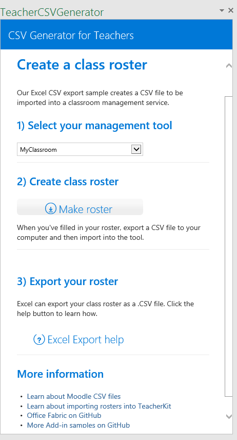
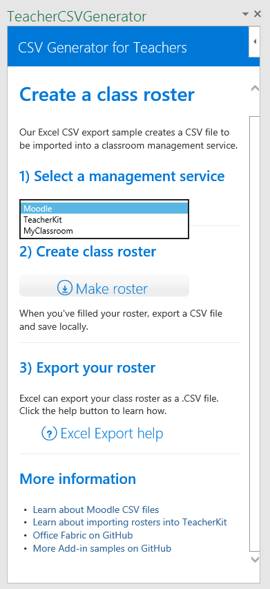
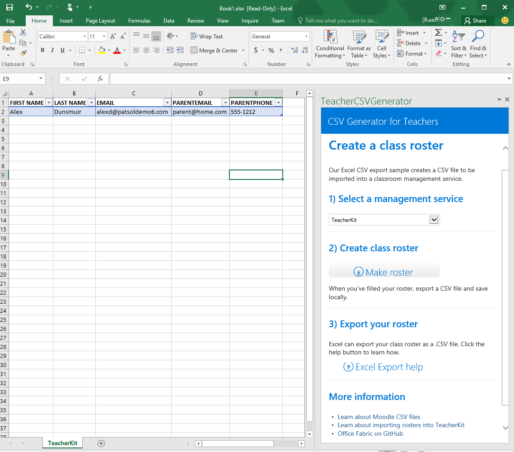

---
page_type: sample
products:
- office-excel
- office-365
languages:
- javascript
extensions:
  contentType: samples
  technologies:
  - Add-ins
  createdDate: 10/15/2015 1:50:50 PM
---
# Ejemplo del complemento del panel de tareas del generador de CSV para Excel 2016

_Se aplica a: Excel 2016_

Este complemento del panel de tareas muestra cómo crear una tabla a partir de una lista de nombres de columna con las API de JavaScript de Excel 2016. Hay dos tipos: editor de código y Visual Studio.

## Pruébelo
### Versión del editor de código

La forma más sencilla de implementar y probar el complemento consiste en copiar los archivos en un recurso compartido de red.

1.  Hospede los archivos en la carpeta de proyecto del Editor de código mediante su servidor favorito.
2.  Edite los elementos \<SourceLocation\> y \<Url\> del archivo de manifiesto para que apunte a la ubicación hospedada que creó en el paso 1 (por ejemplo, https://hostlocal/GeneradorCSV/Home.html).
3.  Copie el manifiesto (TeacherCSVGenerator.xml) en un recurso compartido de red (por ejemplo, \\\MiRecursoCompartido\MisManifiestos).
4.  Agregue la ubicación del recurso compartido que contiene el manifiesto como un catálogo de aplicaciones de confianza en Excel.

    a.  Inicie Excel y abra una hoja de cálculo en blanco.

    b.  Elija la pestaña **Archivo** y, a continuación, **Opciones**.

    c.  Elija **Centro de confianza** y, a continuación, el botón **Configuración del Centro de confianza**.

    d.  Elija **Catálogos de complementos de confianza**.

    e.  En el cuadro **URL del catálogo**, escriba la ruta de acceso al recurso compartido de red que creó en el paso 3 y, a continuación, elija **Agregar catálogo**.

   f. Active la casilla **Mostrar en el menú** y elija **Aceptar**. Aparecerá un mensaje para informarle de que la configuración se aplicará la próxima vez que inicie Office.

5.  Pruebe y ejecute el complemento.

    a.  En la pestaña **Insertar** de Excel 2016, elija **Mis complementos**.

    b.  En el cuadro de diálogo **Complementos de Office**, elija **Carpeta compartida**.

    c.  Elija **Ejemplo de lista de clase para profesores en CSV**>**Insertar**. El complemento se abrirá en un panel de tareas y creará el archivo CSV con la lista de clase en la hoja activa, tal y como se muestra en la captura de pantalla.

   

    d.  Elija un servicio de gestión de aulas.

    e.  Haga clic en el botón Crear lista para insertar una lista vacía en la hoja de cálculo activa.

      

    f.  Haga clic en el botón Ayuda con la exportación de Excel para obtener más información acerca de cómo exportar la hoja de cálculo como archivo .csv.

### Versión de Visual Studio
1.  Copie el proyecto en una carpeta local y abra TeacherCSVGenerator.sln en Visual Studio.
2.  Pulse F5 para crear e implementar el complemento de ejemplo. Excel se inicia y se abre el complemento en un panel de tareas a la derecha de una hoja de cálculo en blanco, como se muestra en la siguiente captura de pantalla.

  

3.  Seleccione un servicio de administración de clases en línea de la lista desplegable.
4.  Agregue una tabla de lista de alumnos con el botón **Make roster** (Hacer lista) y vea la tabla creada en la hoja de cálculo activa.

  
5.  Rellene las celdas en las filas bajo el encabezado de la tabla para agregar alumnos a la lista.
6.  Use la característica de exportar en Excel para guardar la hoja de cálculo como un archivo .csv. Este archivo está en el formato correcto para importar en el servicio de su elección.

### Más información

Las API de JavaScript de Excel tienen mucho que ofrecer para el desarrollo de complementos. A continuación se muestran algunos de los recursos disponibles.

1.  [Introducción a la programación de complementos de Excel](https://github.com/OfficeDev/office-js-docs/blob/master/excel/excel-add-ins-programming-overview.md)
2.  [Explorador de fragmentos de código para Excel](http://officesnippetexplorer.azurewebsites.net/#/snippets/excel)
3.  [Ejemplos de código de complementos de Excel](https://github.com/OfficeDev/office-js-docs/blob/master/excel/excel-add-ins-code-samples.md)
4.  [Referencia de la API de JavaScript de complementos de Excel](https://github.com/OfficeDev/office-js-docs/blob/master/excel/excel-add-ins-javascript-reference.md)
5.  [Compilar el primer complemento de Excel](https://github.com/OfficeDev/office-js-docs/blob/master/excel/build-your-first-excel-add-in.md)

Este proyecto ha adoptado el [Código de conducta de código abierto de Microsoft](https://opensource.microsoft.com/codeofconduct/). Para obtener más información, consulte las [preguntas más frecuentes sobre el Código de conducta](https://opensource.microsoft.com/codeofconduct/faq/) o póngase en contacto con [opencode@microsoft.com](mailto:opencode@microsoft.com) si tiene otras preguntas o comentarios.
