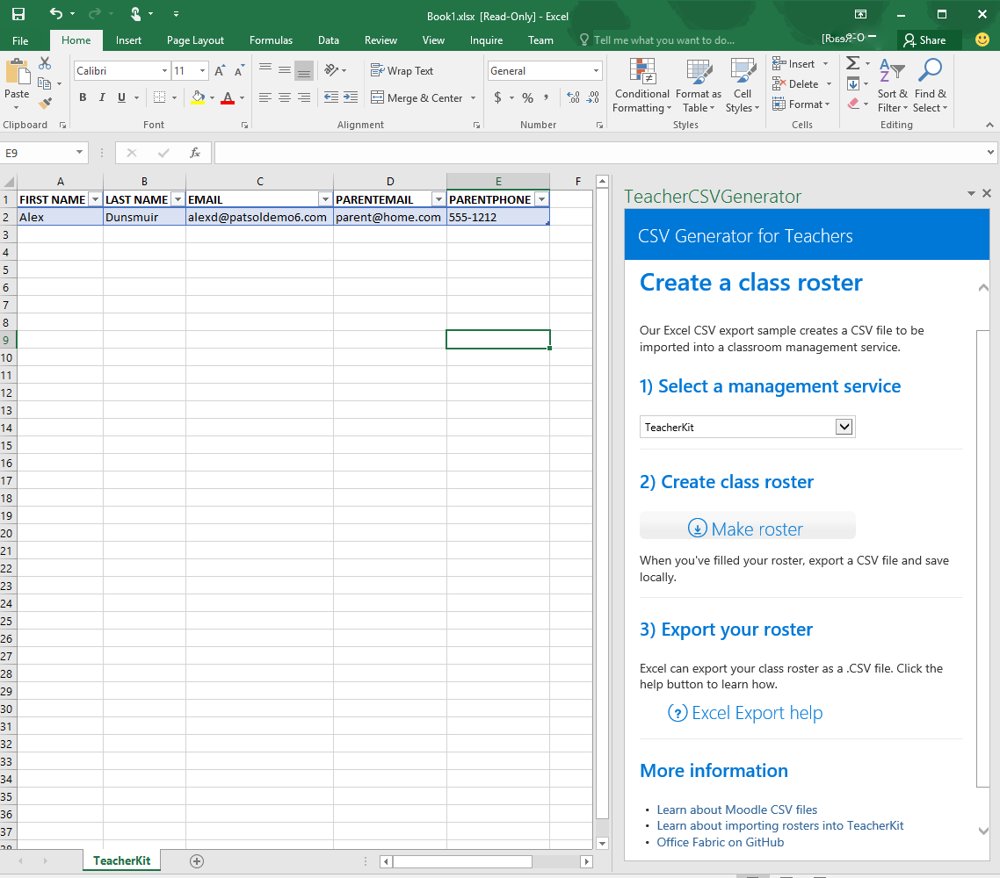

# Excel 2016 用の CSV ジェネレーター作業ウィンドウ アドインのサンプル

_適用対象:Excel 2016_

この作業ウィンドウ アドインには、Excel 2016 で JavaScript Api を使用した、列名のリストからのテーブルの作成方法が示されます。コード エディターと Visual Studio のいずれかを選択できます。

## お試しください。
### コード エディターのバージョン

アドインを展開してテストする最も簡単な方法は、ファイルをネットワーク共有にコピーすることです。

1.  任意のサーバーを使用して、コード エディターのプロジェクト フォルダー内のファイルをホストします。
2.  マニフェスト ファイルの \<SourceLocation\> 要素と \<URL\> 要素を編集して、手順 1 で作成したホストの場所 (たとえば https://localhost/CSVGenerator/Home.html) をポイントするようにします。
3.  マニフェスト (TeacherCSVGenerator.xml) をネットワーク共有 (たとえば \\\MyShare\MyManifests) にコピーします。
4.  マニフェストを格納する共有の場所を、Excel で信頼されるアプリ カタログとして追加します。

    a.Excel を起動し、空のスプレッドシートを開きます。

    b.**[ファイル]** タブを選び、**[オプション]** を選びます。

    c.**[セキュリティ センター]** を選択し、**[セキュリティ センターの設定]** ボタンを選択します。

    d.**[信頼されているアドイン カタログ]** を選びます。

    e.**[カタログの URL]** ボックスで、手順 3 で作成したネットワーク共有のパスを入力し、**[カタログの追加]** を選択します。

   f. **[メニューに表示する]** チェック ボックスをオンにしてから **[OK]** を選択します。これらの設定は Office を次回起動したときに適用されることを示すメッセージが表示されます。

5.  アドインをテストし、実行します。

    a.Excel 2016 の **[挿入]** タブで、**[個人用アドイン]** を選択します。

    b.**[Office アドイン]** ダイアログ ボックスで、**[共有フォルダー]** を選択します。

    c.**[教師用 CSV クラス名簿のサンプル]**>**[挿入]** の順に選択します。アドインが作業ウィンドウで開き、次のスクリーンショットに示すように、作業中のシートで CSV クラス名簿が作成されます。

   

    d.教室管理サービスを選択します。

    e.作業中のワークシートに空の名簿を挿入するには、[名簿の作成] ボタンをクリックします。

      

    f.ワークシートを .csv ファイルとしてエクスポートする方法については、[Excel エクスポートのヘルプ] ボタンをクリックします。

### Visual Studio のバージョン
1.  プロジェクトをローカル フォルダーにコピーし、Visual Studio で TeacherCSVGenerator.sln を開きます。
2.  F5 キーを押して、サンプル アドインをビルドおよび展開します。Excel が起動し、次のスクリーンショットに示すように、空白のワークシートの右側の作業ウィンドウでアドインが開きます。

  

3.  ドロップダウン リストからオンラインの教室管理サービスを選択します。
4.  **[名簿の作成]** ボタンを使用して、学生名簿テーブルを追加し、アクティブ ワークシートで作成されたテーブルを確認します。

  
5.  テーブルの見出しの下の行のセルに値を入力することによって、名簿に学生を追加します。
6.  Excel のエクスポート機能を使用して、.csv ファイルとしてワークシートを保存します。このファイルは、選択したサービスにインポートするのに適した形式です。

### 詳細を見る

アドインを開発する際に Excel JavaScript API でできることは他にも数多くあります。以下は、利用可能なリソースのほんの一例です。

1.  [Excel アドインのプログラミングの概要](https://github.com/OfficeDev/office-js-docs/blob/master/excel/excel-add-ins-programming-overview.md)
2.  [Excel のスニペット エクスプローラー](http://officesnippetexplorer.azurewebsites.net/#/snippets/excel)
3.  [Excel アドインのコード サンプル](https://github.com/OfficeDev/office-js-docs/blob/master/excel/excel-add-ins-code-samples.md)
4.  [Excel アドインの JavaScript API リファレンス](https://github.com/OfficeDev/office-js-docs/blob/master/excel/excel-add-ins-javascript-reference.md)
5.  [最初の Excel アドインをビルドする](https://github.com/OfficeDev/office-js-docs/blob/master/excel/build-your-first-excel-add-in.md)