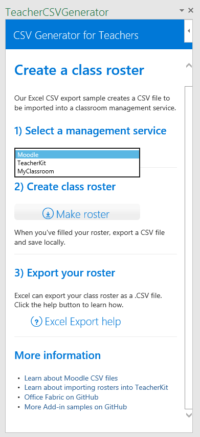

# Пример надстройки области задач для Excel 2016, создающей CSV-таблицы

_Область применения: Excel 2016_

Этот пример надстройки области задач показывает, как создать таблицу из списка имен столбцов с помощью API JavaScript в Excel 2016. Надстройка представлена в двух вариантах — для редактора кода и для Visual Studio.

## Проверка
### Версия для редактора кода

Самый простой способ развернуть и проверить надстройку — скопировать эти файлы в сетевую папку.

1.  Разместите файлы из папки Code Editor project (Проект редактора кода) на нужном сервере.
2.  Измените элементы \<SourceLocation\> и \<Url\> в файле манифеста, чтобы он указывал на расположение, упоминавшееся на этапе 1 (например, https://localhost/CSVGenerator/Home.html).
3.  Скопируйте манифест (TeacherCSVGenerator.xml) в сетевую папку (например, \\\MyShare\MyManifests).
4.  Добавьте общую папку, содержащую этот манифест, в качестве доверенного каталога приложений в Excel.

    А.  Запустите Excel и откройте пустую электронную таблицу.

    Б.  Перейдите на вкладку **Файл**, а затем выберите **Параметры**.

    В.  Выберите **Центр управления безопасностью**, а затем нажмите кнопку **Параметры центра управления безопасностью**.

    Г.  Выберите пункт **Доверенные каталоги надстроек**.

    Д.  В поле **URL-адрес каталога** введите путь к общему сетевому ресурсу, созданному на шаге 3, и выберите **Добавить каталог**.

   Установите флажок **Показывать в меню** и нажмите кнопку **ОК**. Появится сообщение о том, что параметры будут применены при следующем запуске Office.

5.  Проверьте и запустите надстройку.

    А.  На вкладке **Вставка** в Excel 2016 выберите элемент **Мои надстройки**.

    Б.  В диалоговом окне **Надстройки Office** выберите элемент **Общая папка**.

    В.  Выберите элементы **Teacher CSV Class Roster sample** (Пример надстройки, создающей CSV-файл классного журнала) > **Вставить**. Надстройка откроется в области задач и создаст CSV-файл классного журнала на основе данных на активном листе, как показано на снимке экрана.

   

    Г.  Выберите службу управления обучением.

    Д.  Нажмите кнопку "Make Roster" (Создать журнал), чтобы добавить пустой журнал на активный лист.

      

    Е.  Чтобы узнать, как экспортировать лист как CSV-файл, нажмите кнопку "Excel Export Help" (Справка по экспорту в Excel).

### Версия для Visual Studio
1.  Скопируйте проект в локальную папку и откройте файл TeacherCSVGenerator.sln в Visual Studio.
2.  Нажмите клавишу F5, чтобы собрать и развернуть пример надстройки. Запустится Excel, а надстройка откроется в области задач справа от пустого листа, как показано на представленном ниже снимке экрана.

  

3.  Выберите веб-службу управления аудиториями из раскрывающегося списка.
4.  Добавьте таблицу со списком учащихся, нажав кнопку **Make roster** (Создать список), и изучите таблицу, созданную на активном листе.

  
5.  Добавьте учащихся в список, заполнив ячейки в строках под заголовком таблицы.
6.  Сохраните лист как CSV-файл с помощью функции экспорта Excel. Этот формат подходит для импорта в любую службу.

### Подробнее

Интерфейсы API JavaScript в Excel предоставляют существенно расширенные возможности для разработки надстроек. Ниже указаны лишь некоторые из доступных ресурсов.

1.  [Общие сведения о программировании надстроек Excel](https://github.com/OfficeDev/office-js-docs/blob/master/excel/excel-add-ins-programming-overview.md)
2.  [Обозреватель фрагментов кода для Excel](http://officesnippetexplorer.azurewebsites.net/#/snippets/excel)
3.  [Примеры кода надстроек Excel](https://github.com/OfficeDev/office-js-docs/blob/master/excel/excel-add-ins-code-samples.md)
4.  [Справочник по API JavaScript для надстроек Excel](https://github.com/OfficeDev/office-js-docs/blob/master/excel/excel-add-ins-javascript-reference.md)
5.  [Создание первой надстройки Excel](https://github.com/OfficeDev/office-js-docs/blob/master/excel/build-your-first-excel-add-in.md)

Этот проект соответствует [правилам поведения Майкрософт, касающимся обращения с открытым кодом](https://opensource.microsoft.com/codeofconduct/). Дополнительную информацию см. в разделе [часто задаваемых вопросов по правилам поведения](https://opensource.microsoft.com/codeofconduct/faq/). Если у вас возникли вопросы или замечания, напишите нам по адресу [opencode@microsoft.com](mailto:opencode@microsoft.com).
